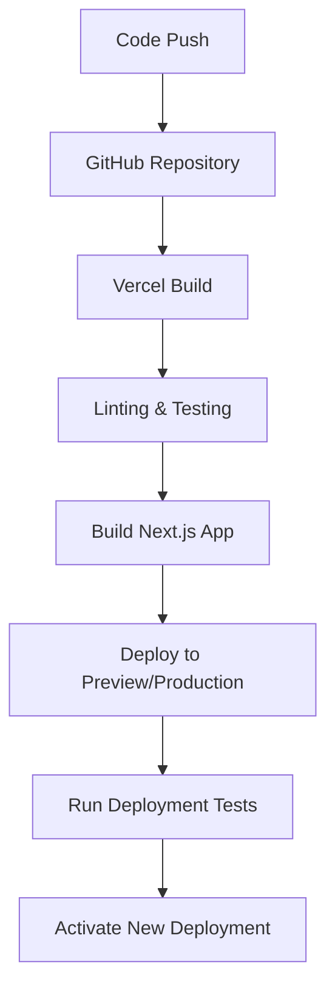

# Vercel Infrastructure Architecture

## Overview

This document outlines the infrastructure architecture for deploying our Next.js application on Vercel. Vercel provides a seamless deployment platform optimized for Next.js applications with built-in CI/CD, edge caching, and serverless functions.

## Architecture Diagram

```
┌─────────────────────────────────────────────────────────────────┐
│                         Vercel Platform                          │
│                                                                 │
│  ┌───────────────┐    ┌───────────────┐    ┌───────────────┐   │
│  │   Frontend    │    │   Serverless  │    │     Edge      │   │
│  │   (Static)    │    │   Functions   │    │   Network     │   │
│  └───────┬───────┘    └───────┬───────┘    └───────────────┘   │
│          │                    │                    ▲            │
│          │                    │                    │            │
│          └────────────────────┼────────────────────┘            │
│                               │                                 │
└───────────────────────────────┼─────────────────────────────────┘
                                │
                                ▼
┌─────────────────────────────────────────────────────────────────┐
│                      External Services                           │
│                                                                 │
│  ┌───────────────┐    ┌───────────────┐    ┌───────────────┐   │
│  │   Supabase    │    │   Prisma      │    │   Other APIs  │   │
│  │  (Database)   │◄───┤     ORM       │    │  & Services   │   │
│  └───────────────┘    └───────────────┘    └───────────────┘   │
│                                                                 │
└─────────────────────────────────────────────────────────────────┘
```

## Key Components

### 1. Vercel Platform

Vercel serves as our primary deployment and hosting platform, providing several key features:

#### Frontend Hosting
- **Static Asset Delivery**: Optimized delivery of HTML, CSS, JS, and media files
- **Automatic Minification**: Built-in optimization for production builds
- **Image Optimization**: Automatic image resizing and optimization via Next.js Image component
- **Global CDN**: Content delivery through Vercel's global edge network

#### Serverless Functions
- **API Routes**: Next.js API routes deployed as serverless functions
- **Server Components**: React Server Components rendered at the edge
- **Middleware**: Custom request handling via Next.js middleware
- **Cold Starts**: Minimal cold start times for improved performance

#### Edge Network
- **Global Distribution**: Automatic deployment to edge locations worldwide
- **Caching**: Intelligent caching of static assets and API responses
- **SSL/TLS**: Automatic HTTPS certificates and renewal
- **DDoS Protection**: Built-in protection against distributed denial-of-service attacks

### 2. External Services

Our application integrates with several external services:

#### Supabase
- **PostgreSQL Database**: Primary data storage
- **Authentication**: User authentication and management
- **Storage**: File storage for user-generated content
- **Realtime**: WebSocket connections for live updates

#### Prisma ORM
- **Database Access**: Type-safe database access layer
- **Migrations**: Database schema version control
- **Data Modeling**: Structured data models with relationships

#### Other Services
- **Sentry**: Error tracking and monitoring
- **Analytics**: User behavior tracking
- **Payment Processing**: Integration with payment providers (if applicable)
- **Email Services**: Transactional email delivery

## Deployment Architecture

### Git-based Workflow

Our deployment process follows a Git-based workflow:

1. **Development**:
   - Developers work on feature branches
   - Changes are pushed to GitHub repository

2. **Preview Deployments**:
   - Pull requests trigger automatic preview deployments
   - Each PR gets a unique URL for testing and review

3. **Production Deployment**:
   - Merges to `main` branch trigger production deployments
   - Automatic rollbacks available if issues are detected

### Environment Configuration

We manage different environments through Vercel's environment configuration:

| Environment | Branch | Purpose | Access |
|-------------|--------|---------|--------|
| Production | main | Live application | Public |
| Preview | Pull requests | Testing changes | Team members |
| Development | Feature branches | Local development | Developers |

### Environment Variables

Sensitive configuration is managed through Vercel's environment variables:

```
# Database
DATABASE_URL=postgresql://...

# Authentication
NEXTAUTH_SECRET=...
NEXTAUTH_URL=...

# Supabase
NEXT_PUBLIC_SUPABASE_URL=...
NEXT_PUBLIC_SUPABASE_ANON_KEY=...

# External Services
SENTRY_DSN=...
```

Environment variables can be scoped to specific environments (Production, Preview, Development).

## Scaling Strategy

### Automatic Scaling

Vercel provides automatic scaling for our application:

- **Serverless Functions**: Scale to zero when not in use, scale up with demand
- **Static Assets**: Served from global CDN with unlimited scaling
- **Database**: Supabase provides managed scaling for PostgreSQL

### Performance Optimization

We implement several performance optimization techniques:

1. **Static Generation**: Pre-render pages at build time where possible
2. **Incremental Static Regeneration**: Update static pages without full rebuilds
3. **Edge Caching**: Leverage Vercel's edge network for caching
4. **Code Splitting**: Automatic code splitting for optimized loading
5. **Image Optimization**: Automatic image resizing and format conversion

## Monitoring and Observability

### Vercel Analytics

Vercel provides built-in analytics for monitoring application performance:

- **Web Vitals**: Core Web Vitals monitoring (LCP, FID, CLS)
- **Edge Network**: Performance metrics for edge function execution
- **Deployment Tracking**: Monitor deployment success and failures

### External Monitoring

We supplement Vercel's built-in monitoring with:

- **Sentry**: Error tracking and performance monitoring
- **Custom Logging**: Structured logging for serverless functions
- **Uptime Monitoring**: External service to verify application availability

## Security Architecture

### Authentication and Authorization

- **NextAuth.js**: Authentication framework integrated with Supabase
- **Role-Based Access Control**: Permissions managed through Supabase RLS
- **JWT Tokens**: Secure token-based authentication

### Data Security

- **HTTPS Only**: All traffic encrypted in transit
- **Database Encryption**: Data encrypted at rest in Supabase
- **Environment Isolation**: Separate environments for development and production

### Compliance Considerations

- **GDPR**: Data processing agreements with Vercel and Supabase
- **Cookie Consent**: Implementation for EU users
- **Data Residency**: Consider Vercel's region selection for data sovereignty

## Disaster Recovery

### Backup Strategy

- **Database Backups**: Automated Supabase backups
- **Code Versioning**: All code maintained in Git repository
- **Infrastructure as Code**: Environment configuration version controlled

### Recovery Procedures

1. **Rollbacks**: Instant rollbacks to previous deployments via Vercel dashboard
2. **Database Restoration**: Procedures for restoring from Supabase backups
3. **DNS Failover**: Contingency plans for DNS-level failover if needed

## Cost Optimization

### Vercel Pricing Tiers

Our deployment leverages Vercel's pricing model:

- **Hobby Tier**: For development and small projects
- **Pro Tier**: For production applications with team collaboration
- **Enterprise Tier**: For applications requiring advanced security and support

### Cost Management Strategies

1. **Serverless Architecture**: Pay only for actual usage
2. **Edge Caching**: Reduce function invocations through effective caching
3. **Database Optimization**: Proper indexing and query optimization
4. **Static Generation**: Maximize static content to reduce serverless function calls

## Deployment Pipeline

### CI/CD Integration

Our CI/CD pipeline integrates with Vercel's deployment platform:



### Deployment Configurations

Vercel deployment is configured through `vercel.json`:

```json
{
  "version": 2,
  "builds": [
    {
      "src": "package.json",
      "use": "@vercel/next"
    }
  ],
  "routes": [
    {
      "src": "/api/(.*)",
      "dest": "/api/$1"
    },
    {
      "src": "/(.*)",
      "dest": "/$1"
    }
  ],
  "env": {
    "NEXT_PUBLIC_ENVIRONMENT": "production"
  }
}
```

## Local Development Setup

### Development Environment

Developers use a local environment that mirrors production:

1. **Vercel CLI**: Local development using Vercel CLI
   ```bash
   npm install -g vercel
   vercel dev
   ```

2. **Environment Variables**: Local `.env` file for development
   ```
   DATABASE_URL=postgresql://localhost:5432/mydb
   NEXT_PUBLIC_SUPABASE_URL=http://localhost:54321
   NEXT_PUBLIC_SUPABASE_ANON_KEY=...
   ```

3. **Local Supabase**: Docker-based local Supabase instance
   ```bash
   npx supabase start
   ```

## Migration Considerations

### Migrating from Other Platforms

If migrating from another platform to Vercel:

1. **DNS Configuration**: Update DNS records to point to Vercel
2. **Environment Variables**: Transfer environment variables to Vercel dashboard
3. **Build Configuration**: Adjust build settings for Next.js optimization
4. **Serverless Functions**: Refactor any server code to work with Vercel's serverless model

## Best Practices

1. **Immutable Deployments**: Each deployment is immutable and versioned
2. **Branch-Based Workflows**: Leverage preview deployments for all branches
3. **Environment Parity**: Keep development and production environments as similar as possible
4. **Monitoring**: Implement comprehensive monitoring from day one
5. **Performance Budgets**: Establish and enforce performance budgets
6. **Security Scanning**: Regular security scanning of dependencies
7. **Documentation**: Maintain up-to-date deployment documentation

## Limitations and Considerations

1. **Function Size Limits**: Vercel has a 50MB limit for serverless functions
2. **Execution Duration**: Functions have a maximum execution time of 10 seconds (Pro plan)
3. **Vendor Lock-in**: Consider portability if Vercel-specific features are used
4. **Cold Starts**: While minimal, serverless functions still have cold starts
5. **Database Proximity**: Ensure database is in a region close to Vercel functions

## Conclusion

Vercel provides an optimized platform for deploying Next.js applications with minimal configuration. By leveraging Vercel's serverless architecture, global CDN, and integrated CI/CD, we can deliver a high-performance application with excellent developer experience and operational efficiency.

The combination of Vercel for hosting and deployment with Supabase and Prisma for data management creates a powerful, scalable architecture that allows our team to focus on building features rather than managing infrastructure.